# Portfolio Site Infrastructure as Code (IaC) + Agile Methodologies

## Introduction

This project documents the end-to-end setup of my personal portfolio site on AWS using Infrastructure as Code. It covers domain registration, DNS management with Route 53, S3 static site hosting, content delivery and security via CloudFront with ACM certificates, and automated provisioning through Terraform Cloud. A simple Continuous Deployment pipeline was also implemented using GitHub Actions to automatically upload updates to the S3 bucket and invalidate the CloudFront cache on new commits. The project further demonstrates Agile practices such as epics and Kanban tracking to manage and deliver infrastructure tasks effectively.

### Terraform Repository

All Terraform code for this project is available at:  
[tf-cloud-portfolio-site](https://github.com/As4d/tf-cloud-portfolio-site)

#### Architecture Diagram

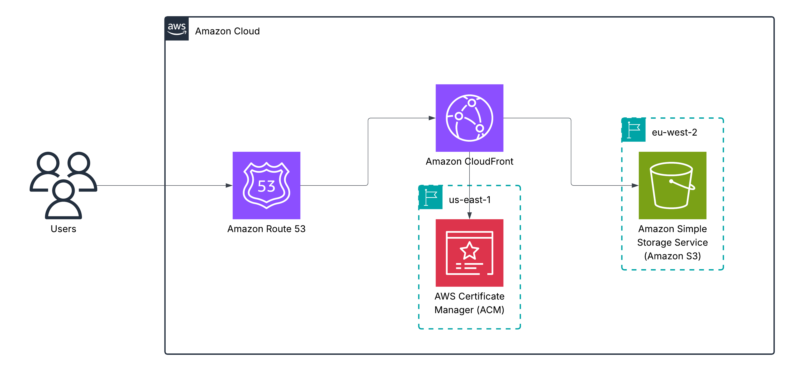

---

## Key Agile Practices Implemented

**Epics**  

Epics are large bodies of work that can be broken down into smaller tasks or user stories. They help in organizing and prioritizing work in a project. In this project, I created four main epics to structure the tasks involved in setting up my portfolio site infrastructure

1. Domain & DNS Setup  
2. Terraform Cloud Setup
3. S3 Static Website Hosting Setup
4. Migrate to Amazon CloudFront Distribution
5. Front CloudFront with Route53
6. Simple CD Pipeline Setup


**Kanban Board** 

Tracked tasks through:
To Do → In Progress → Done.  


---

## Tasks

### 1. Buy Domain & Configure Route 53
**Task:** Register domain and set up hosted zone for DNS management.  
**Approach:** Purchased domain through Route 53 and documented NS records.  
**Outcome:** Domain successfully registered and ready for AWS services.  

  

---

### 2. Terraform Cloud Setup
**Task:** Set up Terraform Cloud for managing infrastructure as code.  
**Approach:** Created account, create organization, set up workspace, connected to GitHub repo.  
**Outcome:** Terraform Cloud workspace ready for managing AWS resources.

**Creating Terraform Cloud Account and Organization:**


Added the AWS access keys as environment variables in Terraform Cloud for authentication.


Tested Terraform Cloud by running a simple plan to ensure connectivity and configuration. I used the following Terraform code:

```[hcl]
provider "aws" {
  region = "eu-west-2" // london
}

resource "aws_vpc" "test" {
  cidr_block = "10.0.0.0/16"
} 
```


Successfully applied the plan to create the VPC and saved the state securely in Terraform Cloud.


**State Management Test**

I was curious to see how Terrform cloud handles the state file if i were to delete a resoure on the cloud. I deleted the VPC from the AWS console and then ran another plan in Terraform Cloud. 


As expected, Terraform detected that the VPC was missing and planned to recreate it. It does this as Terraforms plan command compares the current state of the infrastructure (as recorded in the state file) with the desired state defined in the configuration files.


---

### 3. S3 Static Website Hosting
**Task:** Set up S3 bucket for static website hosting.   
**Approach:** Create S3 bucket, configured for static website hosting, set permissions.  
**Outcome:** S3 bucket configured and ready to host static website content.

**Deprecation of Arguments**

Some arguments in the `aws_s3_bucket` resource have been deprecated in recent versions of the Terraform AWS provider.


arguemnts such as `website`, `acl`, and `versioning` have been deprecated in favor of using separate resources to manage these configurations.

**Seperating Files**

To manage the S3 bucket and its configurations more effectively, I created separate Terraform files for each aspect of the S3 bucket setup. This modular approach improves readability and maintainability of the code.

```
outputs.tf
providers.tf
s3.tf
variables.tf
```

**Building Bucket Policy**

When building the S3 bucket, you are required to attach a bucket policy to allow public read access to the objects within the bucket. 

```[json]
{
    "Version": "2012-10-17",
    "Statement": [
        {
            "Sid": "PublicReadGetObject",
            "Effect": "Allow",
            "Principal": "*",
            "Action": [
                "s3:GetObject"
            ],
            "Resource": [
                "arn:aws:s3:::Bucket-Name/*"
            ]
        }
    ]
}
```

However for the resource `aws_s3_bucket_policy`, you need to use interpolation to insert the bucket name dynamically. I used this tool https://flosell.github.io/iam-policy-json-to-terraform/ to help me convert the JSON policy to HCL format. After conversion and tweaking, I ended up with the following code:

```[hcl]
// build a bucket policy that makes your bucket content publicly available
data "aws_iam_policy_document" "grant_public_read_access" {
  statement {
    sid    = "PublicReadGetObject"
    effect = "Allow"

    principals {
      type        = "*"
      identifiers = ["*"]
    }

    actions = [
      "s3:GetObject"
    ]

    resources = [
      aws_s3_bucket.static_portfolio_site.arn,
      "${aws_s3_bucket.static_portfolio_site.arn}/*",
    ]
  }
}
```

**Testing**

After committing the code to Terraform Cloud, It automatically queued a plan and I was able to review the changes before applying them.


After applying the changes, I verified in the AWS console that the S3 bucket was created successfully. It successfully enabled static website hosting and the bucket policy was attached correctly.


**Uploading Static Content**

For now, I plan on uploading my static website content to the S3 bucket manually via the AWS console for development reasons. It will be an [`index.html`](https://docs.aws.amazon.com/AmazonS3/latest/userguide/HostingWebsiteOnS3Setup.html#step5-upload-index-doc) file from the AWS documentation. In the future, the code will be in a GitHub repo and I can use CI/CD to automate the deployment of the static content to the S3 bucket.


---

### 4. Migrate to Amazon CloudFront Distribution

**Task:** Migrate from S3 static website hosting to Amazon CloudFront distribution.    
**Approach:** Create certificate, create distribution, map origin to S3 bucket.    
**Outcome:** Amazon CloudFront distribution configured and ready to serve static website content.    

**Creating a Certificate**

Certifcates must exist in the `us-east-1` region so that the internal AWS network can access it for CloudFront .

```[HCL]
resource "aws_acm_certificate" "portfolio_site_cert" {
  domain_name = var.portfolio_site_domain_name
  region      = "us-east-1"
  validation_method = "DNS"
}
```

**Creating an Amazon CloudFront Distribution**

When migrating to CloudFront, we dont require S3 bucket website hosting nor do we need to open the bucket for public access. So we remove `aws_s3_bucket_public_access_block` and `aws_s3_bucket_website_configuration`. We also now need to tweak the bucket policy so that only the `cloudfront.amazonaws.com` service can access the bucket. This can be done by adding a `condition` block checking if the `AWS:SourceArn` matches the Arn of the distribution.

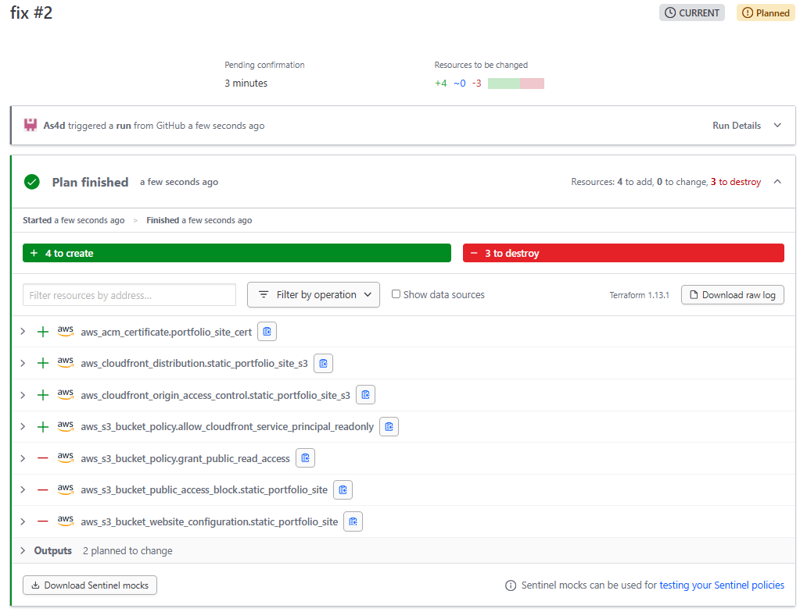

However when applying the changes, I encoutnered some errors. I opened GitHub issues for every error I encountered. Visit [CloudFront Issues](https://github.com/As4d/tf-cloud-portfolio-site/issues/4) for more information.

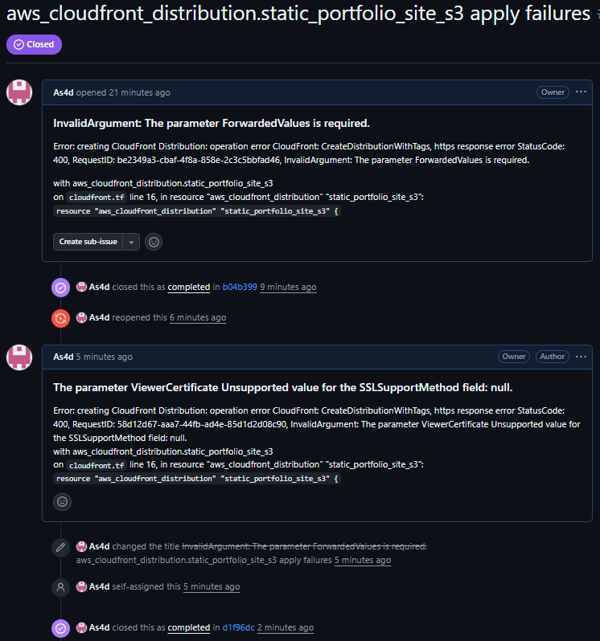

**Key Take Aways**

When I removed the `aws_s3_bucket_website_configuration`, Terraform explicitly disabled static website hosting on my bucket, since it actively manages that configuration. On the other hand, removing the `aws_s3_bucket_public_access_block` resource didn’t automatically revert the setting in AWS - it simply left the old configuration in place because Terraform was no longer managing it. This taught me that disabling vs. “forgetting” resources in Terraform can have very different effects, and it’s important to understand how state management works to avoid unexpected leftovers.

**Succeful Migration**

Now only CloudFront can access the S3 bucket and the static website is being served via CloudFront.

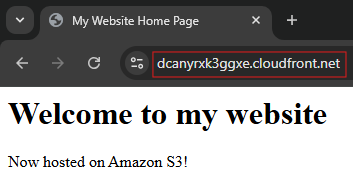
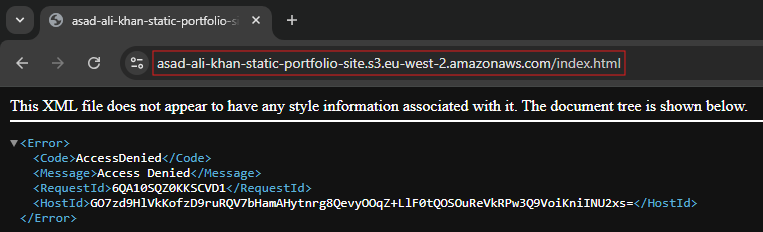 

---

### 5. Front CloudFront with Route53

**Task:** Point domain to CloudFront distribution using Route 53.    
**Approach:** Create alias record in Route 53 pointing to CloudFront distribution.    
**Outcome:** Domain successfully points to CloudFront distribution, serving the static website.    

**Adding Alias Record in Route 53**

To point my domain to the CloudFront distribution, I created an alias record in Route 53. This record maps my domain name to the CloudFront distribution's domain name.

```[hcl]
// Hosted zone
resource "aws_route53_zone" "portfolio_site_hosted_zone" {
  name = var.portfolio_site_domain_name
}

// Create record pointing to CloudFront
resource "aws_route53_record" "portfolio_site" {
  zone_id = aws_route53_zone.portfolio_site_hosted_zone.zone_id
  name    = var.portfolio_site_domain_name
  type    = "A"

  alias {
    name    = aws_cloudfront_distribution.static_portfolio_site_s3.domain_name
    zone_id = aws_cloudfront_distribution.static_portfolio_site_s3.hosted_zone_id
    // CloudFront is a managed service.
    evaluate_target_health = false
  }
}
```

**Issue Encountered**

`http://asadalikhan.co.uk`    
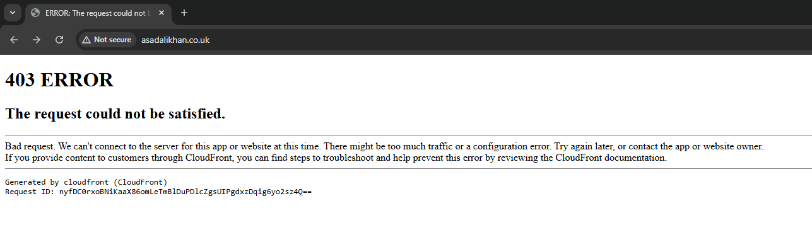

`https://asadalikhan.co.uk`    
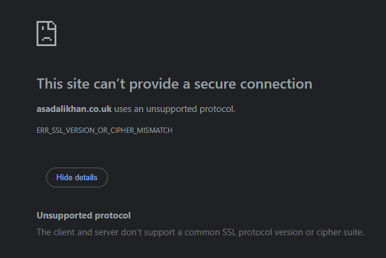

To fix this I had to use a better security policy, previously I was using `TLSv1` but I changed it to `TLSv1.3_2025` which is the most up to date, aswell as adding `asadalikhan.co.uk` to the `aliases` block in the CloudFront distribution.

```[hcl]
...
  aliases = [var.portfolio_site_domain_name]
...
  viewer_certificate {
    acm_certificate_arn      = aws_acm_certificate.portfolio_site_cert.arn
    ssl_support_method       = "sni-only"
    minimum_protocol_version = "TLSv1.3_2025"
  }
```

**Locking Down on Security**

Accessing the website via the CloudFront domain still works, but I want to force all traffic to go through my custom domain. I created a Lambda@Edge function to handle this redirection.

```[js]
function handler(event) {
  var request = event.request;
  var host = request.headers["host"].value;

  if (host !== "asadalikhan.co.uk") {
    return {
      statusCode: 301,
      statusDescription: "Moved Permanently",
      headers: {
        location: { value: "https://asadalikhan.co.uk" },
      },
    };
  }

  return request;
}
```

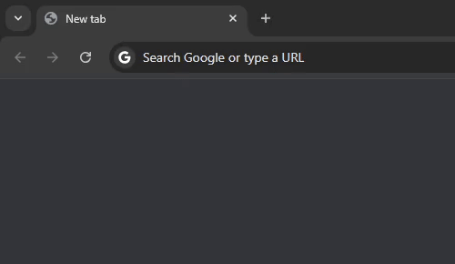

I also enforced HTTPS-only at the CloudFront level.

```[hcl]
  default_cache_behavior {
    ...
    viewer_protocol_policy = "redirect-to-https"
    ...
  }
```

---

### Simple CD Pipeline Setup

**Task:** Implement a simple CI/CD pipeline to automate deployment of static content to S3 bucket.    
**Approach:** Use GitHub Actions to trigger deployments on code changes.    
**Outcome:** Automated deployment of static content to S3 bucket on code changes.   

**Workflow**

A developer merges/pushes code to the prod branch on `portfolio-site` and a GitHub Actions pipeline is triggered. The pipeline pulls the latest website content, uploads it to the S3 bucket using AWS CLI, and invalidates the CloudFront cache to ensure the latest content is served.

**IAM User for GitHub Actions**

A dedicated IAM user `portfolio-site-deploy-user` will be created with least-privilege permissions - them being `s3:PutObject`, `s3:ListBucket`, `s3:DeleteObject` and `cloudfront:CreateInvalidation`.

**Secrets in GitHub**

The IAM user's access key and secret key will be stored as secrets in the GitHub repository settings. These secrets will be referenced in the GitHub Actions workflow to authenticate AWS CLI commands.

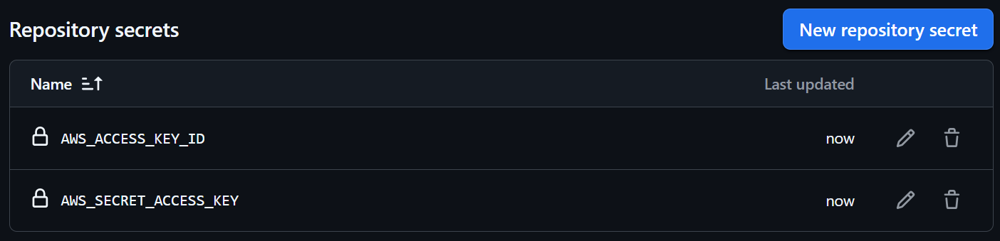

**Testing AWS CLI Authentication**

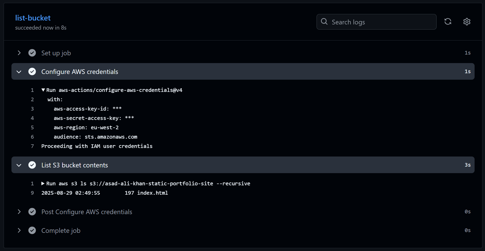

**Enabling S3 Versioning**

To keep track of changes and allow for easy rollbacks, I enabled versioning on the S3 bucket. I added the following resource to my `s3.tf` file:

```[hcl]
resource "aws_s3_bucket_versioning" "static_portfolio_site" {
  bucket = aws_s3_bucket.static_portfolio_site.id
  versioning_configuration {
    status = "Enabled"
  }
}
```

**Issues Encountered**

It ended up pulling code from the root of the repository uploading unnecessary files and folders like `README.md` and `.github`. I had to tweak the `aws s3 sync` command to only upload files from a that has all the relevent files `site` folder.

```yaml
- name: Upload to S3
  run: aws s3 sync ./site s3://asad-ali-khan-static-portfolio-site --delete
```

**Final GitHub Actions Workflow Test**

The workflow ran on the same commit hash `8dc2867` as the push to the `prod` branch, indicating that it was triggered by the push event. The workflow completed successfully, with all steps passing without errors.

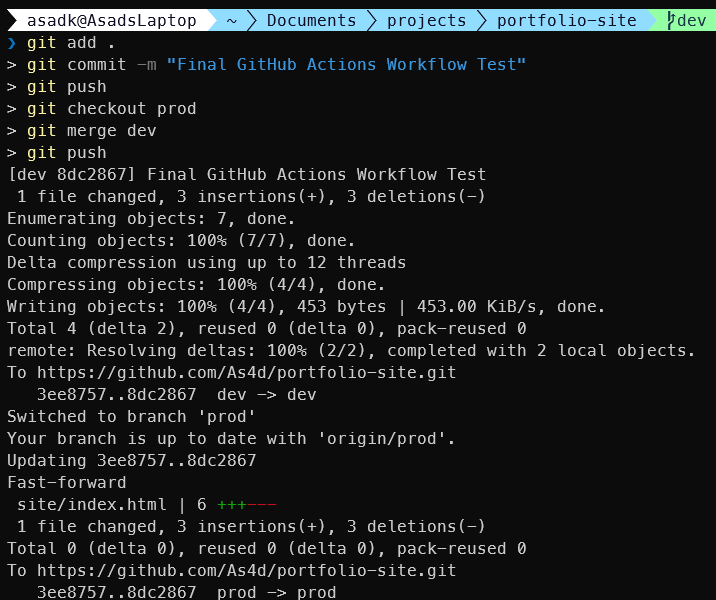
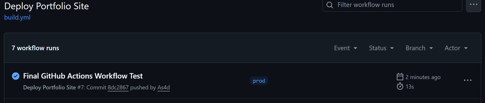
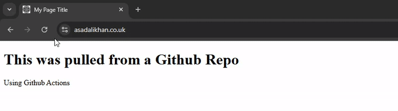

---

## Conclusion

This project successfully demonstrates the use of Infrastructure as Code with Terraform Cloud to set up a personal portfolio site on AWS. It covers domain registration, DNS management, S3 static site hosting, CloudFront distribution, and security configurations. In addition, a GitHub Actions Continuous Deployment pipeline was introduced to automate deployments, ensuring that changes to the site are seamlessly published and propagated through CloudFront. The project also showcases Agile practices such as epics and Kanban tracking to manage and deliver infrastructure tasks effectively. The experience gained from this project has enhanced my understanding of cloud infrastructure management, automation pipelines, and Agile methodologies.