# Portfolio Site Infrastructure as Code (IaC) + Agile Methodologies

## **Overview:**
This project documents the setup of my personal portfolio site on AWS.

---

## **Key Agile Practices Implemented:**

Epics are large bodies of work that can be broken down into smaller tasks or user stories. They help in organizing and prioritizing work in a project. In this project, I created three main epics to structure the tasks involved in setting up my portfolio site infrastructure.

**Epics:**  
  1. Domain & DNS Setup  
  2. Terraform Cloud Setup
  3. S3 Static Website Hosting
  4. Connect Domain to S3 Bucket

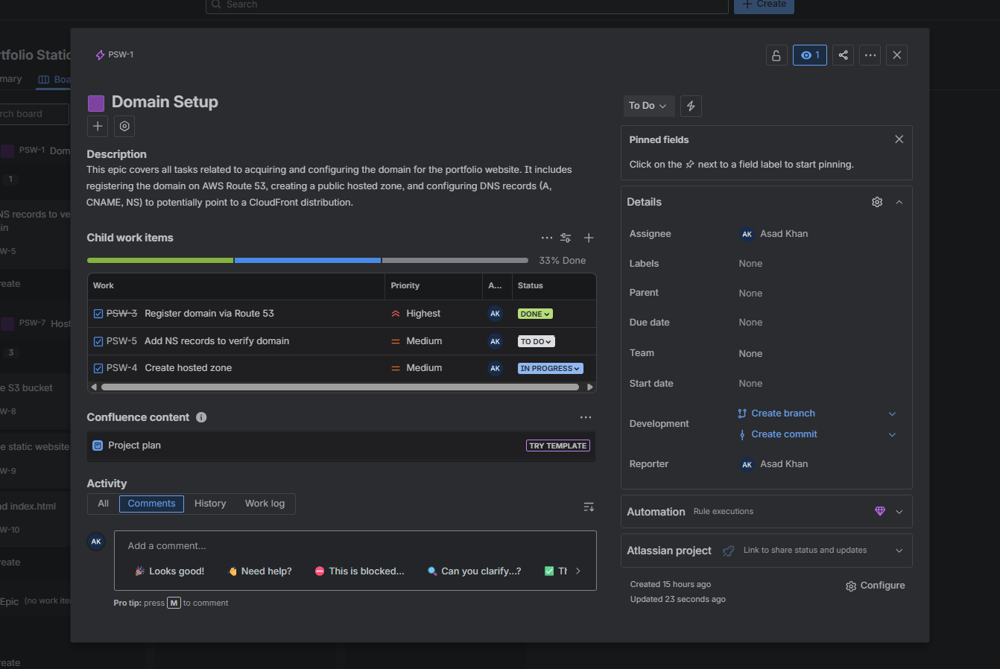

- **Kanban Board:** Tracked tasks through **To Do → In Progress → Done**.  

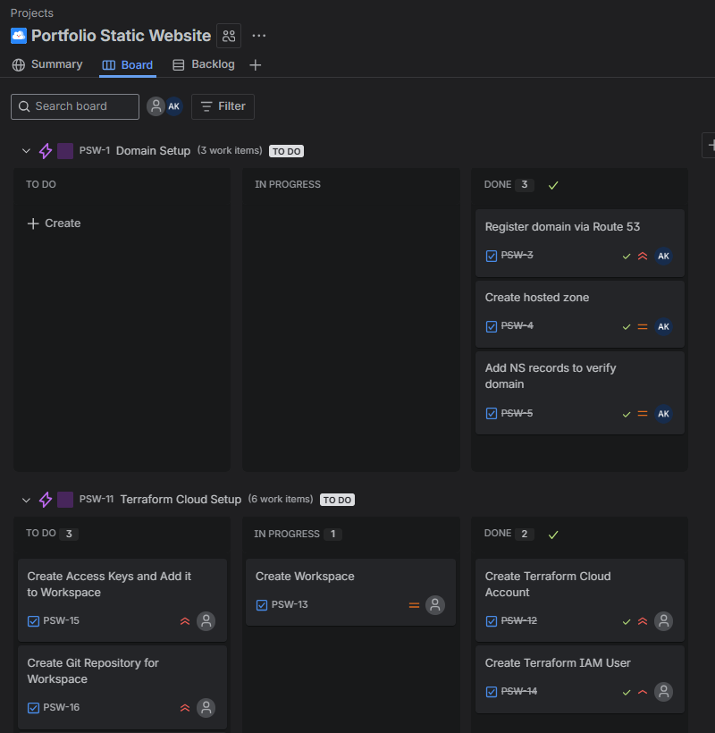

---

## **Tasks:**

### 1. Buy Domain & Configure Route 53
**Task:** Register domain and set up hosted zone for DNS management.  
**Approach:** Purchased domain through Route 53 and documented NS records.  
**Outcome:** Domain successfully registered and ready for AWS services.  

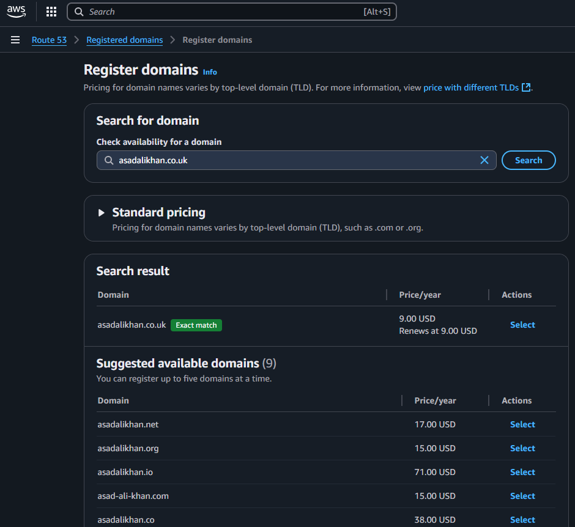  
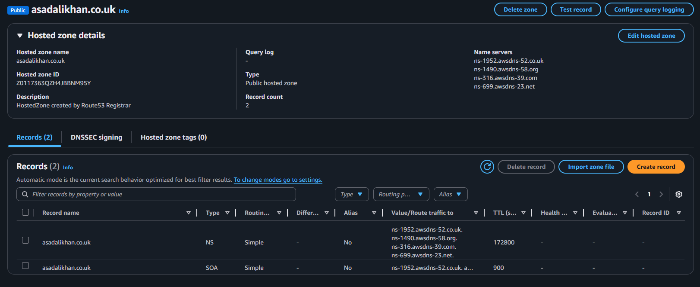

---

### 2. Terraform Cloud Setup
**Task:** Set up Terraform Cloud for managing infrastructure as code.
**Approach:** Created account, create organization, set up workspace, connected to GitHub repo.
**Outcome:** Terraform Cloud workspace ready for managing AWS resources.

**Creating Terraform Cloud Account and Organization:**

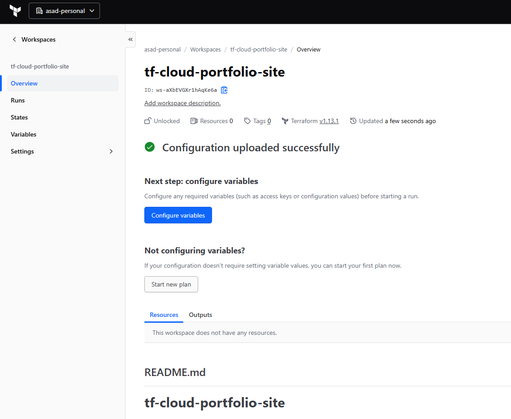

Added the AWS access keys as environment variables in Terraform Cloud for authentication.

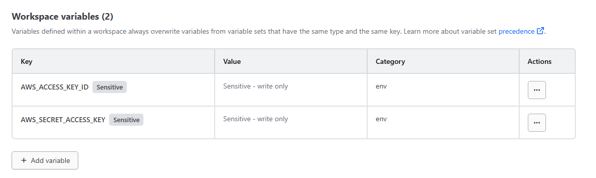

Tested Terraform Cloud by running a simple plan to ensure connectivity and configuration. I used the following Terraform code:

```[hcl]
provider "aws" {
  region = "eu-west-2" // london
}

resource "aws_vpc" "test" {
  cidr_block = "10.0.0.0/16"
} 
```

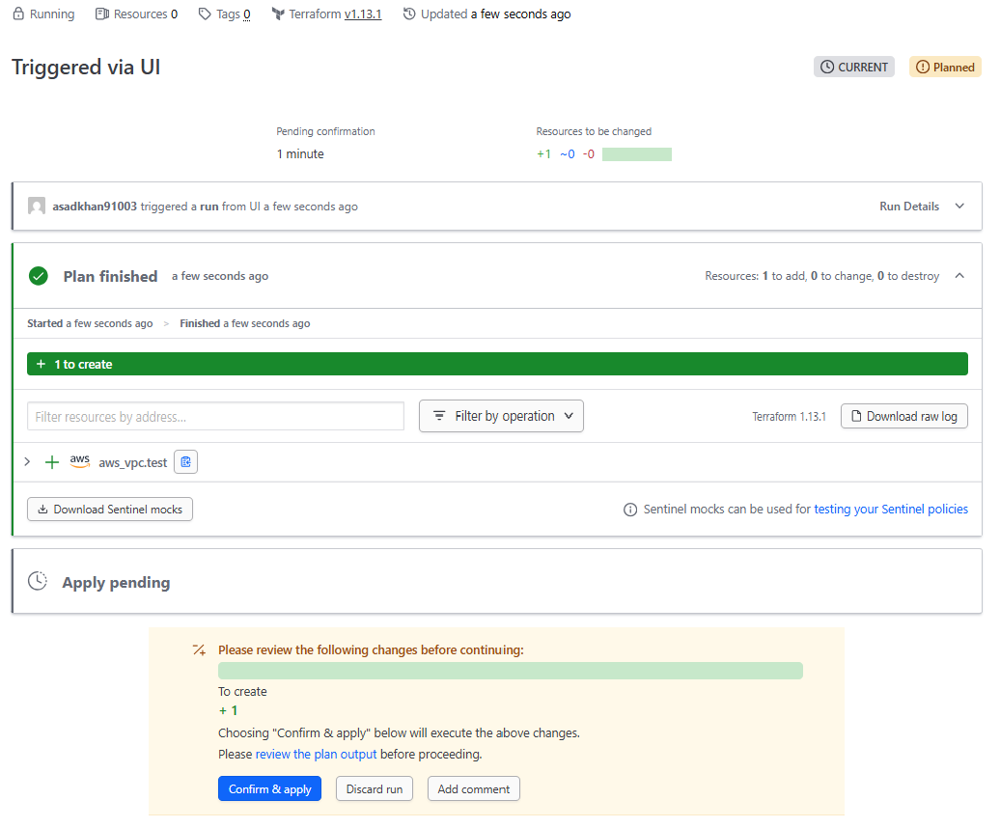

Successfully applied the plan to create the VPC and saved the state securely in Terraform Cloud.

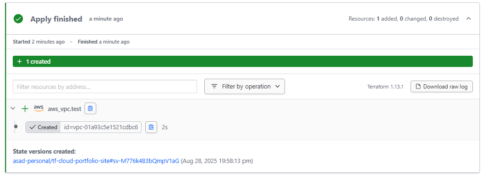

**State Management Test:**

I was curious to see how Terrform cloud handles the state file if i were to delete a resoure on the cloud. I deleted the VPC from the AWS console and then ran another plan in Terraform Cloud. 

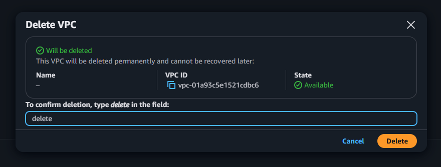

As expected, Terraform detected that the VPC was missing and planned to recreate it. It does this as Terraforms plan command compares the current state of the infrastructure (as recorded in the state file) with the desired state defined in the configuration files.

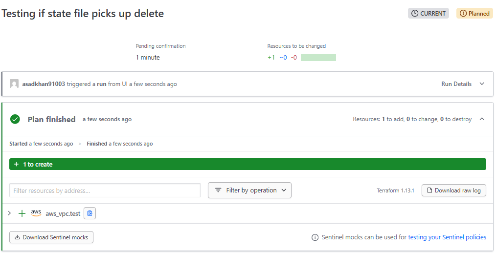

---

### 3. S3 Static Website Hosting
**Task:** Set up S3 bucket for static website hosting.
**Approach:** Create S3 bucket, configured for static website hosting, set permissions.
**Outcome:** S3 bucket configured and ready to host static website content.

**Deprecation of Arguments**

On AWS S3, you can enable static website hosting within the bucket properties. You can specify an index document (e.g., index.html) and an error document (e.g., error.html) to handle requests. However, i found that Terraform had actually deprecated this and other arguments within the resource `aws_s3_bucket`. This does not mean i cannot use them, but for future proofing, its better to use the new S3 resources.

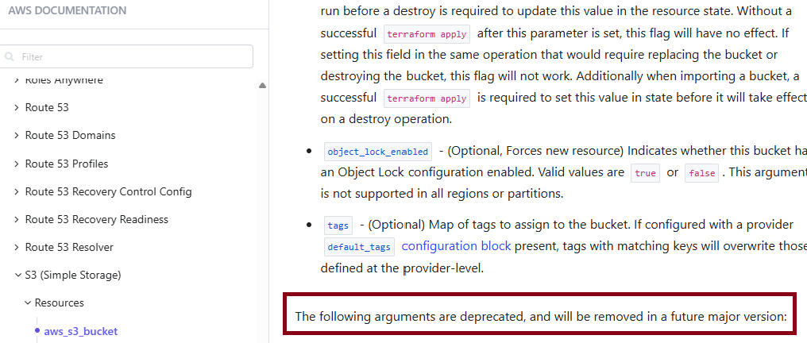

arguemnts such as `website`, `acl`, and `versioning` have been deprecated in favor of using separate resources to manage these configurations.

**Seperating Files**

To manage the S3 bucket and its configurations more effectively, I created separate Terraform files for each aspect of the S3 bucket setup. This modular approach improves readability and maintainability of the code.

```
outputs.tf
providers.tf
s3.tf
variables.tf
```

**Building Bucket Policy**

When building the S3 bucket, you are required to attach a bucket policy to allow public read access to the objects within the bucket. 

```[json]
{
    "Version": "2012-10-17",
    "Statement": [
        {
            "Sid": "PublicReadGetObject",
            "Effect": "Allow",
            "Principal": "*",
            "Action": [
                "s3:GetObject"
            ],
            "Resource": [
                "arn:aws:s3:::Bucket-Name/*"
            ]
        }
    ]
}
```

However for the resource `aws_s3_bucket_policy`, you need to use interpolation to insert the bucket name dynamically. I used this tool https://flosell.github.io/iam-policy-json-to-terraform/ to help me convert the JSON policy to HCL format. After conversion and tweaking, I ended up with the following code:

```[hcl]
// build a bucket policy that makes your bucket content publicly available
data "aws_iam_policy_document" "grant_public_read_access" {
  statement {
    sid    = "PublicReadGetObject"
    effect = "Allow"

    principals {
      type        = "*"
      identifiers = ["*"]
    }

    actions = [
      "s3:GetObject"
    ]

    resources = [
      aws_s3_bucket.static_portfolio_site.arn,
      "${aws_s3_bucket.static_portfolio_site.arn}/*",
    ]
  }
}
```

**Testing**

After committing the code to Terraform Cloud, It automatically queued a plan and I was able to review the changes before applying them.

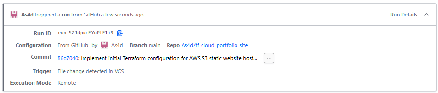
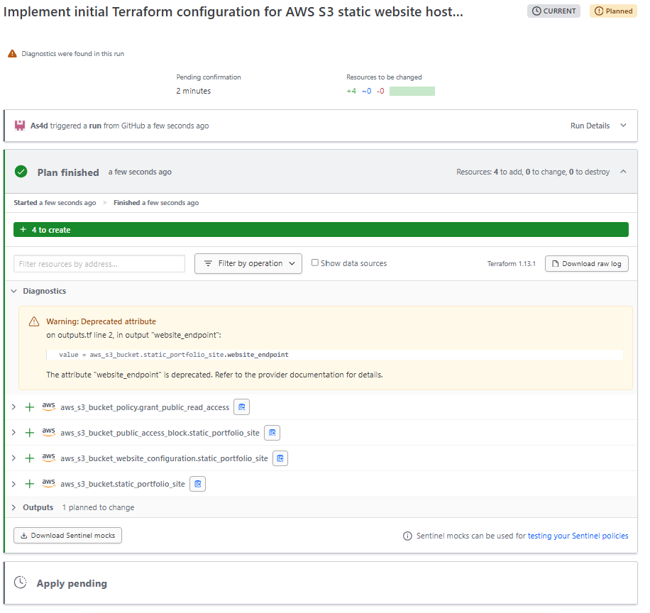

A warning appeared for a deprecated attribute, however it was for the `website_endpoint` output which is not a big issue for now as it doesn't affect the bucket creation. I raised an issue on the Terraform AWS provider GitHub repo to fix later.

After applying the changes, I verified in the AWS console that the S3 bucket was created successfully. It successfully enabled static website hosting and the bucket policy was attached correctly.

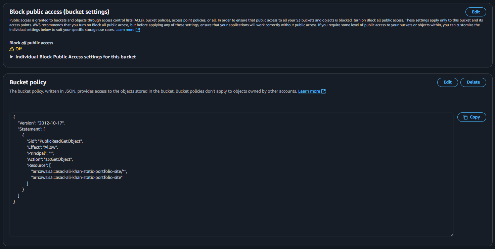

**Uploading Static Content**

As expected, after creating the bucket i should see a 404 error as there is no index document yet.

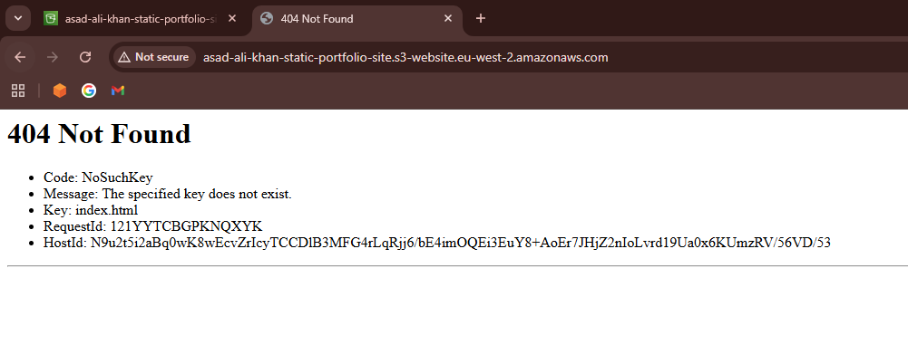

For now, I plan on uploading my static website content to the S3 bucket manually via the AWS console for development reasons. It will be an [`index.html`](https://docs.aws.amazon.com/AmazonS3/latest/userguide/HostingWebsiteOnS3Setup.html#step5-upload-index-doc) file from the AWS documentation. In the future, the code will be in a GitHub repo and I can use CI/CD to automate the deployment of the static content to the S3 bucket.

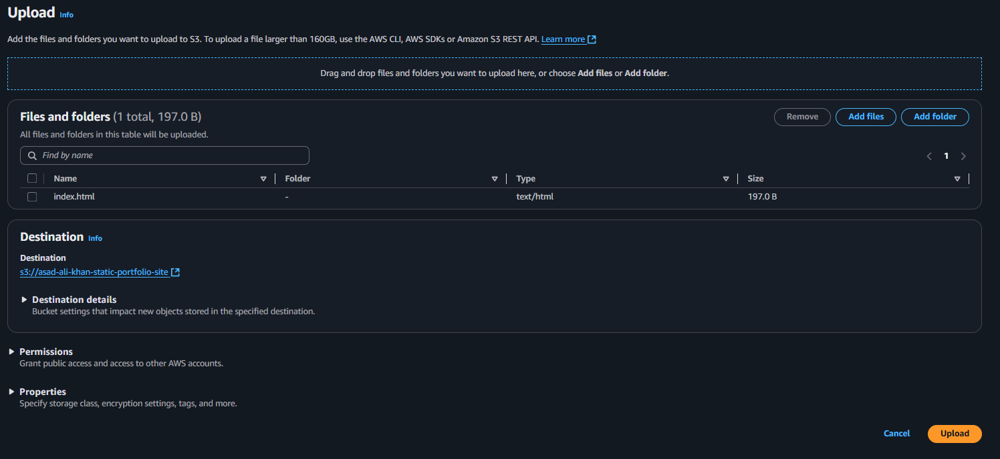
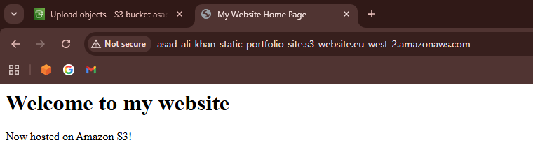